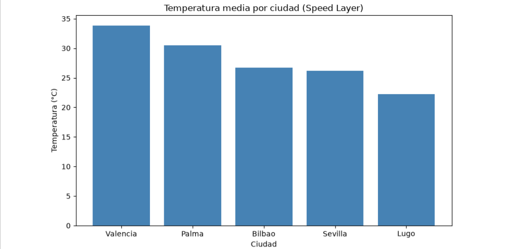
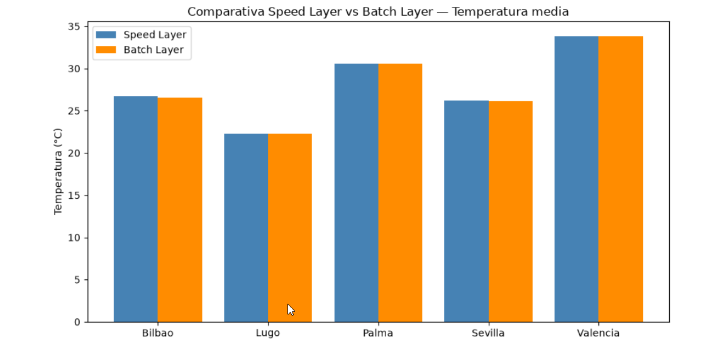

# Fase 5 — Visualización

## Objetivo

Cerrar el ciclo de la arquitectura con una capa de presentación: un notebook Jupyter con PySpark que lee los datos ya persistidos tanto de la Speed Layer (MinIO) como de la Batch Layer (Hive/HDFS), y genera gráficos que permitan comprobar visualmente que ambas capas contienen datos coherentes entre sí.

## Por qué se incorporó esta fase

El diagrama de referencia de esta arquitectura no incluye ningún componente de visualización explícito. Aun así, se decidió añadir esta fase al plan porque, sin ella, no habría forma sencilla de demostrar que las dos capas de la arquitectura (Speed y Batch) contenían realmente datos coherentes entre sí — algo central para poder defender el ejercicio con algo más que la palabra de que "funciona". Entre las opciones valoradas para mostrar los resultados (consultas directas por línea de comandos, una herramienta de paneles conectada a Hive, o un notebook con gráficos), se eligió el notebook por reutilizar el mismo entorno de procesamiento (Spark) ya construido en el resto del proyecto, sin necesidad de añadir un componente de infraestructura nuevo dedicado solo a paneles visuales.

## Investigación de la imagen oficial de Jupyter, y por qué se descartó

Antes de construir una imagen propia, se investigó activamente si la imagen oficial de Jupyter para PySpark era una opción adecuada, en lugar de descartarla de memoria. Esa investigación confirmó que dicha imagen trae empaquetada su propia versión de Spark, y que la etiqueta más cercana disponible no garantizaba coincidir exactamente con la versión 3.5.8 ya usada en el resto del proyecto (productor, consumidor de streaming, y clúster de procesamiento). Usar una versión de Spark distinta en el notebook frente al resto del proyecto se consideró una fuente de riesgo innecesaria, así que se optó por construir una imagen propia, replicando el mismo patrón ya validado en los contenedores del clúster de procesamiento y del consumidor de streaming: una base con Java 21 y PySpark 3.5.8 instalado mediante el gestor de paquetes de Python, añadiendo además JupyterLab para la interfaz del notebook, y las librerías necesarias para generar gráficos y manipular los resultados agregados.

## Decisión de desactivar el token de acceso de Jupyter

Se configuró el servicio de Jupyter para arrancar sin exigir un token de acceso, en lugar de dejar el comportamiento por defecto (que genera un token distinto en cada arranque y hay que copiarlo de los registros del contenedor para poder entrar). Esta decisión se justificó por tratarse de un entorno de desarrollo local, sin ninguna exposición a redes externas — en ese contexto, exigir un token no aporta ninguna protección real y sí añade fricción innecesaria para acceder al notebook cada vez que se reinicia el contenedor.

## Elección de puerto y dependencias declaradas del contenedor

El notebook se expuso en el puerto 8888, el puerto convencional y esperado para un servicio Jupyter, sin ningún motivo adicional más allá de esa convención. En cuanto a las dependencias declaradas para este contenedor, se hizo depender explícitamente de que el almacén de objetos y el namenode de HDFS estuvieran ya definidos como servicios, pero **deliberadamente no** del metastore ni del servidor de Hive. Esta decisión es coherente con otra decisión tomada más adelante, dentro de esta misma fase, de leer los datos de la Batch Layer directamente de los ficheros en HDFS sin pasar por el metastore de Hive — al no necesitar hablar con Hive en ningún momento, tampoco tenía sentido declarar una dependencia hacia esos servicios.

## Primer arranque y verificación de acceso

Tras levantar el contenedor, se verificó accediendo por navegador a la dirección del notebook, confirmando que la interfaz de JupyterLab cargaba directamente sin pedir ningún token, tal como se había configurado, antes de empezar a trabajar dentro de él.

## Primera celda: sesión Spark en modo local, no contra el clúster

A diferencia del consumidor de la Speed Layer, el notebook ejecuta Spark en modo local dentro del propio contenedor, en lugar de conectarse al clúster de procesamiento distribuido ya construido en una fase anterior. La razón es que aquí se trata de consultas puntuales sobre datos ya persistidos, no de un trabajo de streaming continuo — no se necesita la potencia distribuida del clúster para este propósito, y ejecutar en modo local evita además cualquier posible desajuste de versión entre el notebook y los nodos trabajadores del clúster.

Para la configuración de acceso al almacén de objetos MinIO desde esta sesión, se reutilizó exactamente el mismo patrón de configuración y la misma versión del conector de almacenamiento ya usados en el consumidor de la Speed Layer, en lugar de investigarlo de nuevo desde cero — coherencia que además reduce el riesgo de introducir una incompatibilidad nueva en un punto ya resuelto anteriormente en el proyecto.

Se ejecutó esta primera celda y se confirmó que la sesión se inicializaba correctamente, imprimiendo la versión de Spark en uso como comprobación.

## Nota sobre una dependencia instalada mas no utilizada

En la imagen de este notebook se instaló también la librería cliente del almacén de objetos (`boto3`), replicando el mismo patrón de dependencias ya usado en el consumidor de la Speed Layer. Sin embargo, en las celdas de código finalmente escritas para esta fase, esa librería **no llega a usarse en ningún momento** — toda la lectura de datos, tanto de MinIO como de HDFS, se hace a través de Spark, sin ninguna llamada directa a esa librería. Se deja esta anotación de forma consciente, en lugar de omitirla, porque para un documento pensado como manual de réplica es más útil señalar una dependencia arrastrada por costumbre y no verificada como necesaria, que dar a entender que todo lo instalado se llegó a usar.

## Segunda celda: lectura de la Speed Layer

Se leyeron los datos ya persistidos en el almacén de objetos por el consumidor de la Speed Layer, mostrando una muestra de 10 filas y el conteo total de registros como primera comprobación visual de que los datos tenían sentido, sin necesidad de mostrar ni procesar el conjunto completo en ese momento. Esta primera lectura devolvió 265 registros en total, con valores de temperatura y el resto de campos coherentes con lo esperado para las cinco ciudades monitorizadas.

## Incidencia: el módulo `distutils` no existe en Python 3.12

Al intentar generar el primer gráfico, que requería convertir un resultado agregado de Spark a una estructura de datos de pandas, apareció un error indicando que no se encontraba el módulo `distutils`. La causa fue que Python 3.12 eliminó ese módulo de su librería estándar, mientras que la versión de PySpark en uso todavía dependía de él internamente para esa conversión concreta. En lugar de modificar el código interno de PySpark para evitar esa dependencia, se optó por bajar la versión de Python de la imagen base del notebook a la serie 3.11, donde ese módulo todavía existe — replicando el mismo tipo de incompatibilidad de versión de Python con la que ya se había topado el proyecto en otro punto anterior.

Tras reconstruir la imagen del notebook con esta corrección y relanzar el contenedor, fue necesario **volver a ejecutar las dos primeras celdas** (la sesión de Spark y la lectura de la Speed Layer) dentro del notebook ya reiniciado, confirmando que ambas seguían funcionando correctamente igual que antes, antes de reintentar la celda del gráfico que había fallado.

## Tercera celda: primer gráfico, y por qué agregar antes de convertir a pandas

Con la corrección ya aplicada, se generó el primer gráfico: la temperatura media por ciudad, calculada sobre el total de registros acumulados de la Speed Layer. El cálculo de esa media se hizo dentro de la propia sesión de Spark (agrupando por ciudad y calculando el promedio ahí), y solo el resultado ya agregado —cinco filas, una por ciudad— se convirtió a una estructura de pandas para dibujar el gráfico. Se decidió así, en lugar de convertir a pandas los 265 registros completos y agregar ya fuera de Spark, como buena práctica general: evitar traer al proceso principal más datos de los estrictamente necesarios para el resultado final, aunque en este caso concreto el volumen de datos fuera pequeño y la diferencia práctica mínima.

## Cuarta celda: lectura de la Batch Layer sin pasar por el metastore de Hive

Para leer los datos de la Batch Layer, no se estableció ninguna conexión al metastore de Hive. En su lugar, se leyó directamente la ubicación física donde Hive almacena los ficheros de la tabla Parquet gestionada, ya que son ficheros Parquet estándar que Spark puede leer sin necesidad de hablar con el metastore — evitando así una configuración adicional de integración entre Spark y Hive que no aportaba nada para este caso de uso puntual de solo lectura. Se mostró una muestra más reducida, de 5 filas, junto con el conteo total, como comprobación visual equivalente a la ya hecha con la Speed Layer.

## Quinta celda: gráfico comparativo entre ambas capas

Se generó un último gráfico comparando, para cada una de las cinco ciudades, la temperatura media calculada a partir de la Speed Layer frente a la calculada a partir de la Batch Layer. El cruce entre ambos conjuntos de datos agregados se hizo usando el nombre de la ciudad como clave común — algo que solo pudo funcionar sin fricciones porque el modelo de datos diseñado al principio del proyecto se había mantenido consistente en las dos capas hasta este punto final, con las mismas cinco ciudades y el mismo campo de nombre en ambas, cerrando así el círculo con las decisiones tomadas en la primera fase del proyecto.

## Incorporación de las capturas de pantalla al documento

Tras verificar ambos gráficos en el propio notebook, se guardaron dos capturas de pantalla del resultado. Se creó una carpeta dedicada dentro de la documentación del proyecto para alojarlas, y se estableció una correspondencia explícita entre cada captura y la celda de código que la generaba, en lugar de dejarlas sueltas sin relación clara con el código — la captura del primer gráfico (temperatura por ciudad, solo Speed Layer) se asoció a la tercera celda, y la captura del gráfico comparativo se asoció a la quinta celda, insertándose cada una justo debajo del bloque de código correspondiente.

## Cierre de la fase

Con ambos gráficos generados y verificados visualmente, se dio esta fase por completa, y con ella el conjunto de las cinco fases técnicas del proyecto: datos meteorológicos reales fluyendo de extremo a extremo desde la API de origen, pasando por Kafka, dividiéndose en una Speed Layer y una Batch Layer, hasta llegar a una capa de visualización capaz de comparar ambas y confirmar su coherencia. Se guardó este avance en el control de versiones del proyecto; a diferencia de los registros de cambios anteriores del proyecto, en este cierre no se verificó explícitamente la salida de ese último registro antes de continuar con los siguientes pasos.

## Código de las celdas

### Celda 1 — Sesión Spark con acceso a MinIO

```python
from pyspark.sql import SparkSession

spark = SparkSession.builder \
    .appName("VisualizacionLambdaTiempo") \
    .config("spark.jars.packages", "org.apache.hadoop:hadoop-aws:3.3.4") \
    .config("spark.hadoop.fs.s3a.endpoint", "http://minio:9000") \
    .config("spark.hadoop.fs.s3a.access.key", "minioadmin") \
    .config("spark.hadoop.fs.s3a.secret.key", "minioadmin") \
    .config("spark.hadoop.fs.s3a.path.style.access", "true") \
    .config("spark.hadoop.fs.s3a.connection.ssl.enabled", "false") \
    .config("spark.hadoop.fs.s3a.impl", "org.apache.hadoop.fs.s3a.S3AFileSystem") \
    .getOrCreate()

print("Spark version:", spark.version)
```

### Celda 2 — Lectura de la Speed Layer (MinIO)

```python
df_speed = spark.read.parquet("s3a://speed-layer/lecturas-tiempo/")
df_speed.show(10)
print("Total registros Speed Layer:", df_speed.count())
```

### Celda 3 — Gráfico: temperatura media por ciudad (Speed Layer)

```python
import matplotlib.pyplot as plt

df_pandas = df_speed.groupBy("nombre").avg("temperatura").toPandas()
df_pandas = df_pandas.rename(columns={"avg(temperatura)": "temperatura_media"})
df_pandas = df_pandas.sort_values("temperatura_media", ascending=False)

plt.figure(figsize=(8, 5))
plt.bar(df_pandas["nombre"], df_pandas["temperatura_media"], color="steelblue")
plt.title("Temperatura media por ciudad (Speed Layer)")
plt.ylabel("Temperatura (°C)")
plt.xlabel("Ciudad")
plt.tight_layout()
plt.show()
```



### Celda 4 — Lectura de la Batch Layer (Hive/HDFS)

```python
df_batch = spark.read.parquet("hdfs://namenode:8020/user/hive/warehouse/lecturas_tiempo_parquet")
df_batch.show(5)
print("Total registros Batch Layer:", df_batch.count())
```

### Celda 5 — Gráfico comparativo: Speed Layer vs Batch Layer

```python
df_speed_avg = df_speed.groupBy("nombre").avg("temperatura").toPandas()
df_speed_avg = df_speed_avg.rename(columns={"avg(temperatura)": "speed_layer"})

df_batch_avg = df_batch.groupBy("nombre").avg("temperatura").toPandas()
df_batch_avg = df_batch_avg.rename(columns={"avg(temperatura)": "batch_layer"})

comparativa = df_speed_avg.merge(df_batch_avg, on="nombre").sort_values("nombre")

x = range(len(comparativa))
plt.figure(figsize=(9, 5))
plt.bar([i - 0.2 for i in x], comparativa["speed_layer"], width=0.4, label="Speed Layer", color="steelblue")
plt.bar([i + 0.2 for i in x], comparativa["batch_layer"], width=0.4, label="Batch Layer", color="darkorange")
plt.xticks(x, comparativa["nombre"])
plt.title("Comparativa Speed Layer vs Batch Layer — Temperatura media")
plt.ylabel("Temperatura (°C)")
plt.legend()
plt.tight_layout()
plt.show()
```


